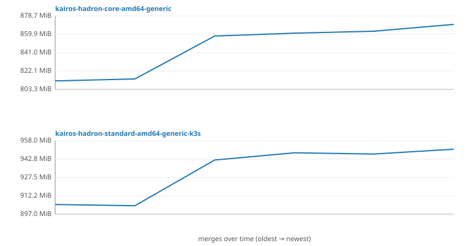

# ISO size history

Raw ISO file size (`wc -c`) of each built ISO, recorded once per merge
to `master`. The CSV (`size-history.csv`) is the source of truth; this
page and the chart are regenerated from it by
`scripts/iso-size-history.sh`.

## Most recent 20 merges

| date | sha | kairos-hadron-core-amd64-generic | kairos-hadron-standard-amd64-generic-k3s |
|---|---| ---: | ---: |
| 2026-08-06 | [`f6a1b2c3d4e5`](https://github.com/thev1ndu/kairos/commit/f6a1b2c3d4e50000000000000000000000000000) [`v0.5.2`](https://github.com/thev1ndu/kairos/releases/tag/v0.5.2) | 870.00 MiB (+7.00 MiB) | 951.00 MiB (+4.00 MiB) |
| 2026-08-06 | [`e5f6a1b2c3d4`](https://github.com/thev1ndu/kairos/commit/e5f6a1b2c3d40000000000000000000000000000) | 863.00 MiB (+2.00 MiB) | 947.00 MiB (-1.00 MiB) |
| 2026-08-06 | [`d4e5f6a1b2c3`](https://github.com/thev1ndu/kairos/commit/d4e5f6a1b2c30000000000000000000000000000) | 861.00 MiB (+3.00 MiB) | 948.00 MiB (+6.00 MiB) |
| 2026-08-06 | [`c3d4e5f6a1b2`](https://github.com/thev1ndu/kairos/commit/c3d4e5f6a1b20000000000000000000000000000) [`v0.5.0`](https://github.com/thev1ndu/kairos/releases/tag/v0.5.0) | 858.00 MiB (+44.00 MiB) | 942.00 MiB (+38.00 MiB) |
| 2026-08-06 | [`b2c3d4e5f6a1`](https://github.com/thev1ndu/kairos/commit/b2c3d4e5f6a10000000000000000000000000000) | 814.00 MiB (+2.00 MiB) | 904.00 MiB (-1.00 MiB) |
| 2026-08-06 | [`a1b2c3d4e5f6`](https://github.com/thev1ndu/kairos/commit/a1b2c3d4e5f60000000000000000000000000000) | 812.00 MiB | 905.00 MiB |

